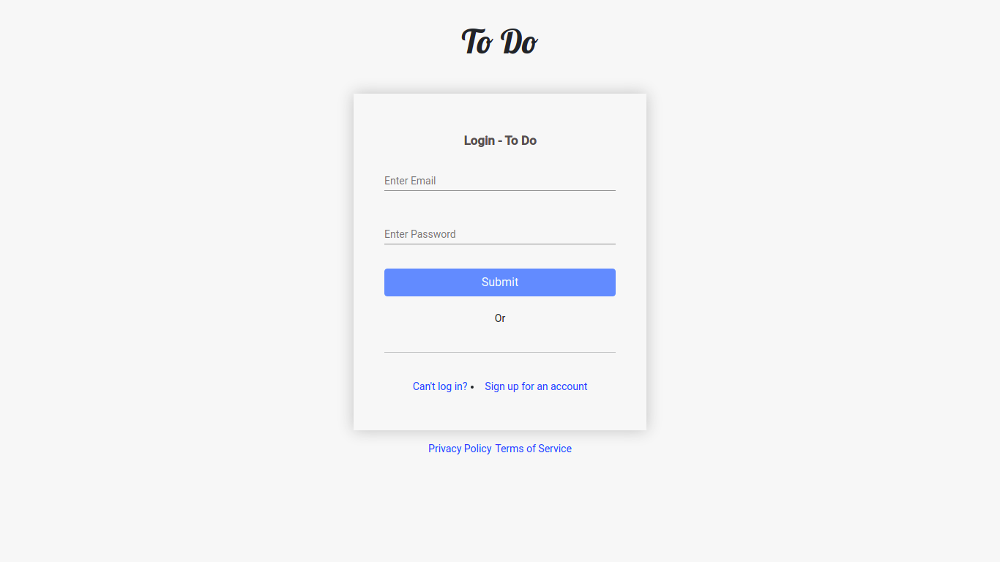
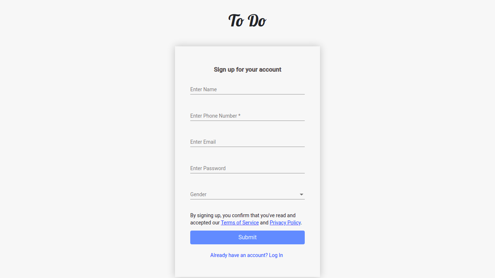
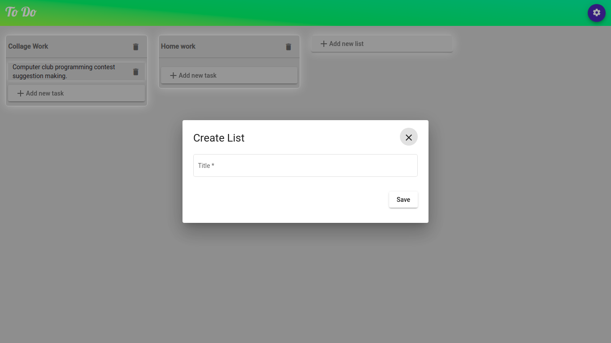

# Task-manager-simple-todo-app

In this application I use angular as front-end development and Node.js (Express js) as server side back-end api development. __This application is simple SPA (Single Page Application)__

You find this application on 
[Simple Todo](https://task-todo-app-web.herokuapp.com/ "google")

## Some Screenshot 
#### Home Page

#### Login Page

#### Sign Up Page

#### Main To do page

